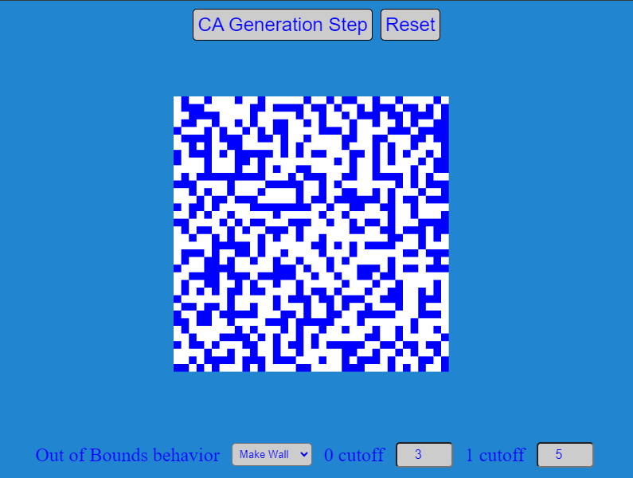

# Cellular Automata Demo

## Description

The demo simply consists of a 36x36 tilemap of blue and white tiles. Blue tiles represent the walls, and white tiles represent the
floor tiles. There are two buttons, one that resets the simulation, and the other button triggers the CA algorithm and uses the tilemap
to demonstrate the results.

Also added to the demo is access to some of the variables that manipulate the simulation. We can now modify the behavior of the OOB
indexes. For instance, instead of the default 'walls', you can now change the sim to use random setting, mirror the edge tile, or set
it constant to 'wall' or 'floor'.

You also have to ability to see what happens when you unbalance the trigger points. Above we defined 3 and 5 as the trigger points for
flipping a tile's state. You have the ability to modify that and see the results it has on the simulation.

The demo starts with a noise field which is a plugin for Excalibur. Using a numbered array representing the 36x36 tilemap, which has
ones and zeroes we can feed this array into the CA function. You can repeatedly press the 'CA Generation Step' button and the same
array can be re-fed into the algorithm to see the step by step iteration, and then can be reset to a new noise field again to start
over.
